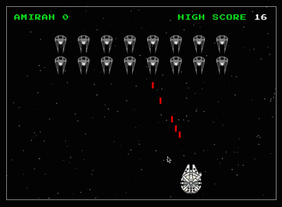

# SG SEI-23 - Project 1

<a href="https://amirahsham01.github.io/imperial-invaders/">Imperial Invaders</a>

## Introduction
An adaptation of a classic 1970s arcade game, this version is themed after Star Wars. The player starts as Millenium Falcon, stuck in a shooting frenzy with swarms of Tie Interceptors. The objective is to defeat the Imperials by firing lasers, survive by tactfully avoiding theirs, and prevent them from reaching the bottom of
the screen.

## Objectives
- Display a game in browser
- Include HTML, CSS and Javascript

## How the game works
- The game is a fixed shooter game
- The player controls the laser/ship by moving it left or right
- The player then fires at descending enemies to defeat them
- In the original game of 'Space Invaders', it is said that the game never ends until your space-craft is irredeemably compromised. In other words, the enemies just keeps coming!

## The plan
- The plan was to create a replica of 'Space Invaders', but with a twist. Themed after yet another pop culture reference, this version takes on the symbols of Star Wars. Because it is also based in space, hence the amalgamation. 
- To draw the player ship, lasers and enemies, the game creates and sets multiple 'div' tags, with background images of icons that represent them. The width and height is then set accordingly to the desired size within the game screen.
- The game uses the basic 'for' loop to move the enemies and lasers. 
- A basic collision detection was used with the 'for' loop as well to remove whichever enemy that was shot.
- The aesthetics of the game was intended to emulate 8-bit, 70s arcade games graphics hence the basic primary colours used with thick solid borders and rectangles.

## Challenges
- I first started my code, using the 'canvas' tag to draw and animate the player ship
- Knowing very little about its uses, I figured it would help me to learn more and discover new programming tricks while attempting to utilize it
- Unfortunately, because it was difficult for me to keep track of its order of 'clearRect' and 'fillRect', the animation of the game turned out sloppy.
- I then sticked to very basic HTML and Javascript using 'url.src' to 'draw' out the images
- My only regret was not using OOP, classes and constructors enough as I was still struggling to comprehend its use

## Further
- To add more levels and increase difficulty because 'Space Invaders' was known to be a game 'that never ends', and that was what hooks players in
- Add boss battles

### Credits
pixelartmaker.com

